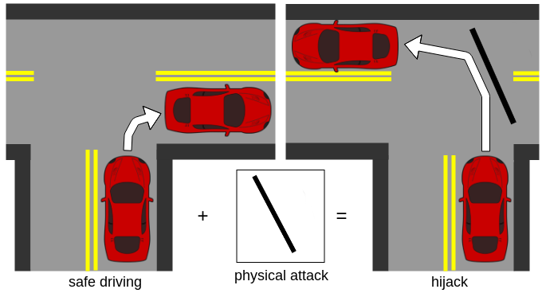

# Adverse Drive

The goal of this project is to attack end-to-end self-driving models using physically realizable adversaries.

|<center>Target Objective</center>| <center>Conceptual Overview</center>| <center>Example</center>  |
| :-: | :-: | :-: |
|Collision Attack| | |
|Hijacking Attack|||

## Pre-requisites

- Ubuntu 16.04
- Dedicated GPU with relevant CUDA drivers
- Docker-CE (for docker method)

**Note: We highly recommend you use the [dockerized version](#docker-method-recommended) of our repository, due to being system independent. Furthermore, it would not affect the packages on your system.**

## Installation
1. Clone the AdverseDrive repository

```bash
git clone https://github.com/xz-group/AdverseDrive
```

2. Export Carla paths to `PYTHONPATH`

```bash
source export_paths.sh
```

3. Install the required Python packages

```bash
pip3 install -r requirements.txt
```

4. Download the modified version of the Carla simulator[1], [carla-adversedrive.tar.gz](https://wustl.box.com/s/8k15yp7rb0ckcp7tqmhlh0rje1q1fcjm).
Extract the contents of the directory and navigate into the extracted directory.

```bash
tar xvzf carla-adversedrive.tar.gz
cd carla-adverserdrive
```

5. Run the Carla simulator on a terminal

```bash
./CarlaUE4.sh -windowed -ResX=800 -ResY=600
```
This starts Carla as a server on port 2000. Give it about 10-30 seconds to start up depending on your system.

6. On a new terminal, start a python HTTP server. This allows the Carla simulator to read the generated attack images and load it onto Carla

```bash
sh run_adv_server.sh
```
**Note: This requires port 8000 to be free.**

7. On another new terminal, run the infraction objective python script

```bash
python3 start_infraction_experiments.py
```
Note: the Jupyter notebook version of this script, called `start_infraction_experiments.ipynb` describes each step in detail. It is recommended to use that while starting out with this repository. Use `jupyter notebook` to start a jupyter server in this directory.

## How it Works

1. The above steps sets up an experiment defined by the experiment parameters in `config/infraction_parameters.json`, including the Carla town being used, the task (straight, turn-left, turn-right), different scenes, the port number being used by Carla and Bayesian optimizer[3] parameters.
2. Runs the `baseline scenario` where the Carla Imitation Learning[2] (IL) agent drives a vehicle from point A to point B as defined by the experiment scene and task. It returns a metric from the run (eg: sum of infraction for each frame). The baseline scenario is when there is no attack.
3. The Bayesian Optimizer suggests parameters for the attack, based on the returned metric (which serves as the objective function that we are trying to maximize), the attack is generated by `adversary_generator.py` and placed in `adversary/adversary_{town_name}.png`.
4. Carla reads the adversary image over the HTTP server and places in on pre-determined locations within the road.
5. The IL model again runs through this `attack scenario` and returns a metric.
6. Steps 3-5 are repeated for a set number of experiments, in which successful attacks would be found.


### Docker Method (recommended)

It is expected that you have some experience with dockers, and have [installed](https://docs.docker.com/install/) and tested your installation to ensure you have GPU access via docker containers.
A quick way to test it is by running:
```bash
# docker >= 19.03
docker run --gpus all,capabilities=utility nvidia/cuda:9.0-base nvidia-smi

# docker < 19.03 (requires nvidia-docker2)
docker run nvidia/cuda:9.0-base --runtime=nvidia nvidia-smi
```
And you should get a standard `nvidia-smi` output.

1. Clone the AdverseDrive repo

```bash
git clone https://github.com/xz-group/AdverseDrive
```

2. Pull the modified version of the Carla simulator:

```bash
docker pull xzgroup/carla:latest
```

3. Pull the `AdverseDrive` docker containing all the prerequisite packages for running experiments (also server-friendly)

```bash
docker pull xzgroup/adversedrive:latest
```

4. Run the our dockerized Carla simulator on a terminal

```bash
sh run_carla_docker.sh
```
This starts Carla as a server on port 2000. Give it about 10-30 seconds to start up depending on your system.

6. On a new terminal, start a python HTTP server. This allows the Carla simulator to read the generated attack images and load it onto Carla

```bash
sh run_adv_server.sh
```
Note: This requires port 8000 to be free.

7. On another new terminal, run the `xzgroup/adversedrive` docker

```bash
sh run_docker.sh
```

8. Run the infraction objective python script

```bash
python3 start_infraction_experiments.py
```

## More documentation
- [Frequently Asked Questions](docs/faq.md)
- [Experiment Details](docs/experiment_details.md)

## References
1. Carla Simulator: [https://github.com/carla-simulator/carla](https://github.com/carla-simulator/carla)
2. Imitation Learning: [https://github.com/carla-simulator/imitation-learning](https://github.com/carla-simulator/imitation-learning)
3. Bayesian Optimization: [https://github.com/fmfn/BayesianOptimization](https://github.com/fmfn/BayesianOptimization)

## Citation
If you use our work, kindly cite us using the following:
```
@misc{boloor2019,
    title={Attacking Vision-based Perception in End-to-End Autonomous Driving Models},
    author={Adith Boloor and Karthik Garimella and Xin He and 
    Christopher Gill and Yevgeniy Vorobeychik and Xuan Zhang},
    year={2019},
    eprint={1910.01907},
    archivePrefix={arXiv},
    primaryClass={cs.LG}
}
```
