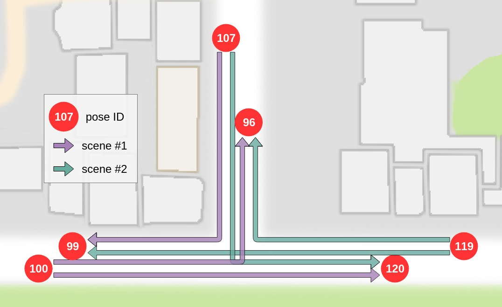

# Experiment Details

## Notations

<dl>
  <dt>Agent / Model </dt>
  <dd>It is the model that controls the vehicle. It takes in relevant input (eg. camera images) and outputs the vehicle control commands (steering, throttle, brake). The Imitation Learning model is an example an agent. </dd>

  <dt>Scenario / Episode</dt>
  <dd>It is where an agent drives a vehicle from one point to another, or until a timeout flag is triggered.</dd>

  <dt>Attack / Adversary</dt>
  <dd>In the context of this project, it is drawing black lines on the road within Carla. Eg. `../adversary/adversary_Town01_nemesisA.png`</dd>

  <dt>Baseline</dt>
  <dd>It is a scenario without any attack.</dd>

  <dt>Hijack</dt>
  <dd>It is defined as the ability to modify the route taken by a vehicle by using physical adversaries.</dd>
</dl>

## Scenario setup

Different tasks and defined in `carla/driving_benchmark/adversary_suite.py` as follows:

```python
def _poses_town01_nemesis(self):
    """
    Each matrix is a new task. We have all the four tasks
    """

    def _poses_straight():
        return [[31, 36], [144, 146]]

    def _poses_turn_right():
        return [[42, 47], [79, 103]]

    def _poses_turn_left():
        return [[70, 66], [85, 98]]

    def _poses_straight_intersection():
        return [[100, 120], [119, 99]]

    def _poses_right_intersection():
        return [[107, 99], [119, 96]]

    def _poses_left_intersection():
        return [[100, 96], [107, 120]]

    return [_poses_straight(),
            _poses_turn_right(),
            _poses_turn_left(),
            _poses_straight_intersection(),
            _poses_right_intersection(),
            _poses_left_intersection()]
```
The numbers for each pose correspond to various starting and ending positions on the map. For example, if we look at three poses at the intersection, we have 6 paths that correspond to the following:

<div align="center">
<figure>
  
  <figcaption>Hijack Poses</figcaption>
</figure>
</div>
